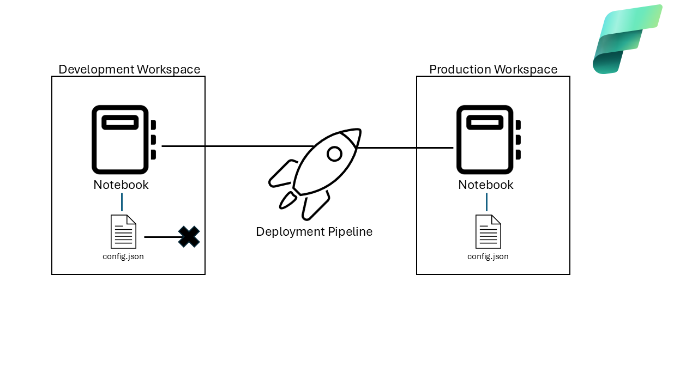
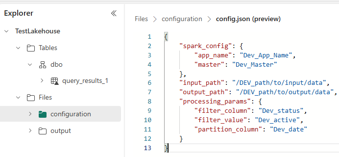
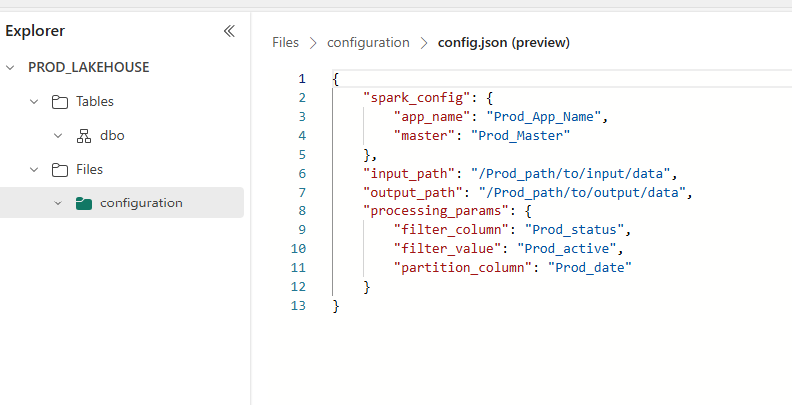
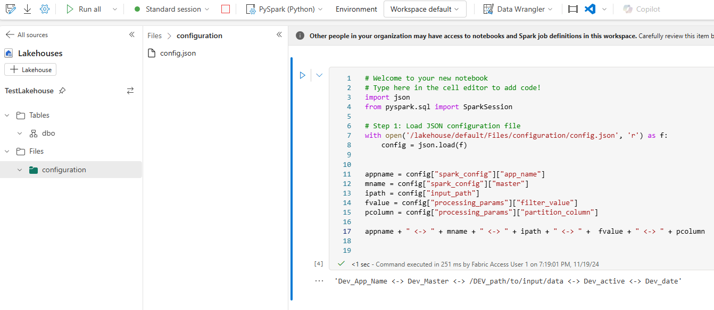
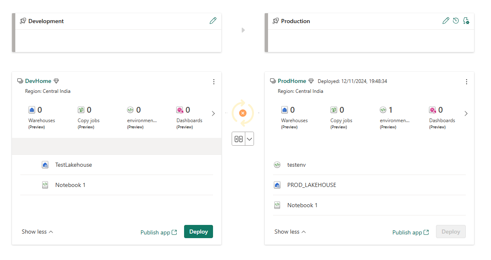
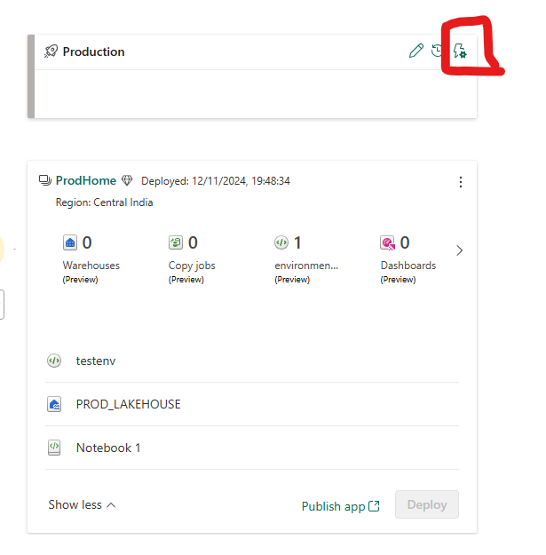
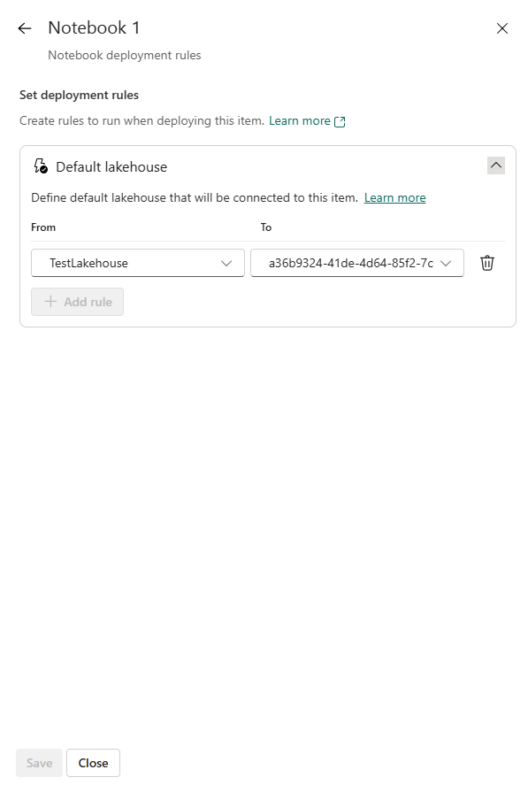
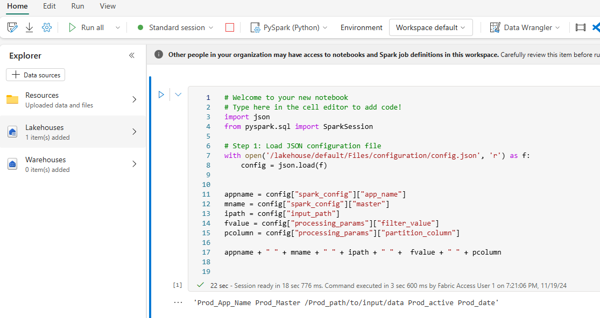

# Dynamic Environment Configuration in Microsoft Fabric Deployment Pipelines

## Business Context

In a multi-stage development environment, maintaining consistency and ensuring that each deployment stage aligns with its specific configuration is critical for data reliability and operational efficiency. When deploying artifacts such as Spark notebooks across stages, it’s essential that the environment-specific references are dynamically updated to reflect the correct data sources, credentials, or paths relevant to each stage.

For instance, an organization may have different storage accounts or database instances designated for Dev, QA, PreProd, and Prod stages. If a Spark notebook deployed in the Dev stage is configured to access data from a specific path in the Dev environment, and this configuration doesn’t update as the notebook moves through the pipeline, it can lead to discrepancies, security risks, and inaccurate data processing in higher environments. Therefore, ensuring that deployment pipelines dynamically adapt notebook references is key to supporting a seamless, efficient development lifecycle.

## Solution

To overcome the challenge of stage-specific references in Spark notebooks, Microsoft Fabric allows for custom configurations to be applied as artifacts move through the Deployment Pipeline. 

 

Here’s a step-by-step approach to achieve this:

1. Start by creating two separate configuration files for each environment: Development and Production. These files should contain environment-specific parameters. After creating the files, upload them to their respective workspaces.

    

    
    
    
    

2. Next, create a notebook in the Development workspace. Within the notebook, reference the variable values from the config.json file to dynamically load environment-specific parameters.

    

3. Create a [deployment pipeline](https://learn.microsoft.com/en-us/fabric/cicd/deployment-pipelines/get-started-with-deployment-pipelines?tabs=from-fabric%2Cnew%2Cstage-settings-new) and assign the appropriate workspaces to the respective stages.   

    

4. Create a rule to change lakehouse from development workspace to production workspace.

    

    
    
    
    

5. Once the deployment pipeline has completed successfully, navigate to the Production workspace and execute the notebook to confirm that the environment-specific parameters have been applied correctly.

    

## Conclusion

Microsoft Fabric’s Deployment Pipeline feature is designed to streamline the artifact deployment process across various stages, enhancing efficiency and operational continuity. By implementing environment-specific configurations and leveraging parameterization, organizations can avoid common pitfalls associated with static references, ensuring that each stage accesses the appropriate resources without manual intervention. This dynamic approach not only reduces deployment errors but also supports a scalable, robust development workflow tailored to meet the demands of modern data and AI projects.

In this blog, we’ve explored the steps to configure deployment pipelines for stage-specific references in Spark notebooks. Implementing these practices will help your organization harness the full potential of Microsoft Fabric, enabling faster, more reliable deployments across all stages of your data and AI lifecycle.
